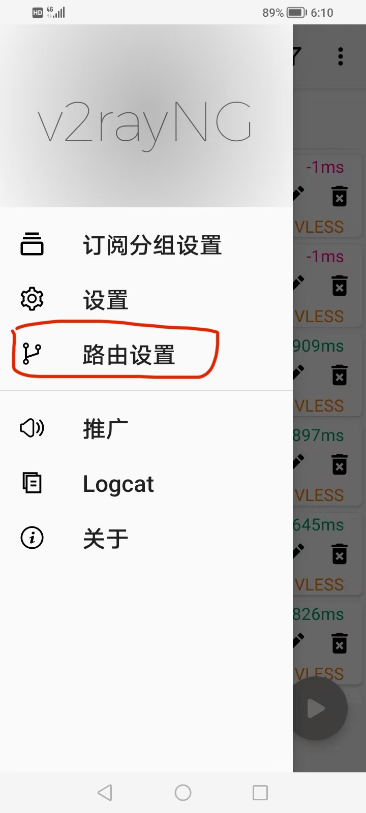

## 1. 下载并安装软件  
### **[网盘]()**

## 2. 导入订阅链接中储存的节点

  
  
  

   

订阅链接：`https://gitee.com/leohuangdev/subscribe/raw/master/subscribe.txt`  

  

## 3. 分应用代理设置  

默认只让浏览器能翻墙。  
如果新安装了需要翻墙的软件，记得来这把那个软件勾选上。

  
  
  
  

## 4. 路由设置  

默认分流，但因为软件 Bug，分流大概率会使节点都无法使用。

  
  

所以要关掉这2个开关，使用全局模式。

## 5. 更新订阅。有效期过了后也相同操作来获取最新节点  

  
  
  

> 会刷出 11 个节点

## 6. 测试哪些节点可用  

  
  

   

  

节点延迟不为 “-1” 的才能使用  
> 只有 787、784、782、783 开头，即标的有国家的节点能访问 ChatGPT 等使用了 Cloudflare CDN 的网站，且访问也不稳定。[比如这些网站](./assets/cloudflareCDN.md)  

## 7. 使用节点  

  

单击选择节点  
右下角按钮是开关
   

  

   
首次开启会申请权限，点“确定”
   

  
  

打开后访问 [ip125.com](http://ip125.com)，出现外国地址就说明你成功了！🎉
